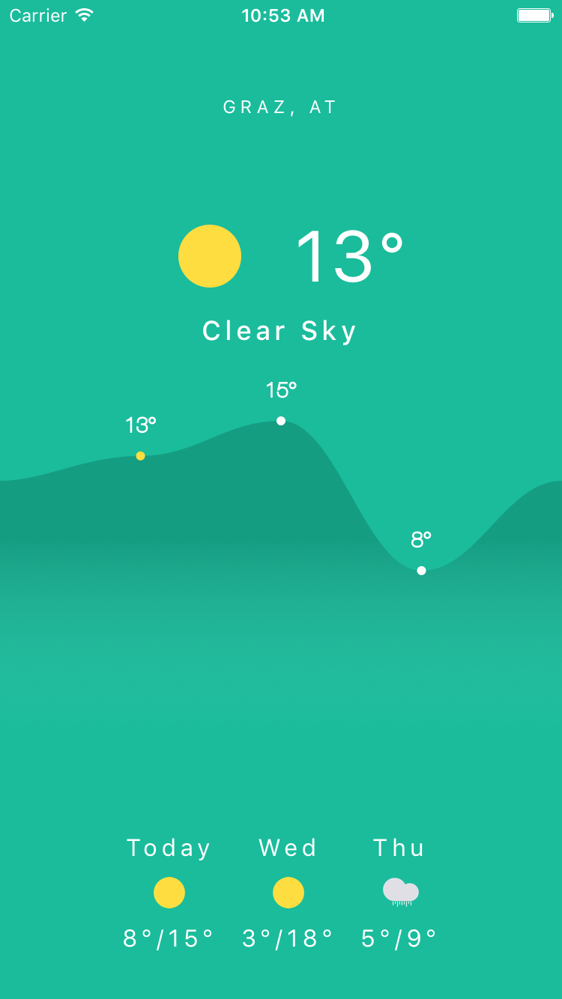
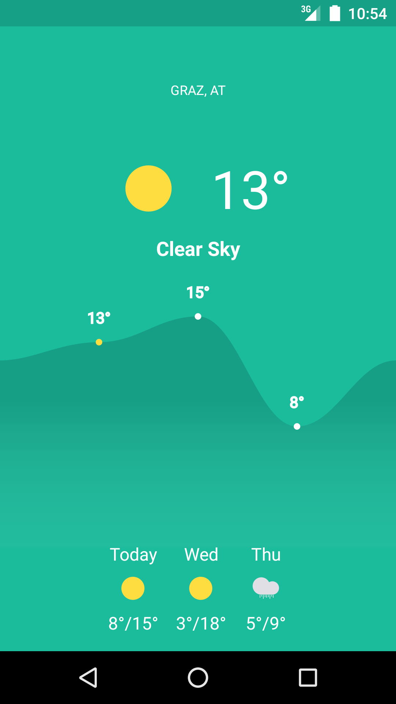

# Weather Demo App created with react-native

# Install

    git clone https://github.com/JanPeter/weather.git
    npm install
    sudo npm install -g rnpm
    rnpm link react-native-svg

# TODO

  [ ] Add input field to change the city (now you have to change line 19 in the WeatherApp.js file)
